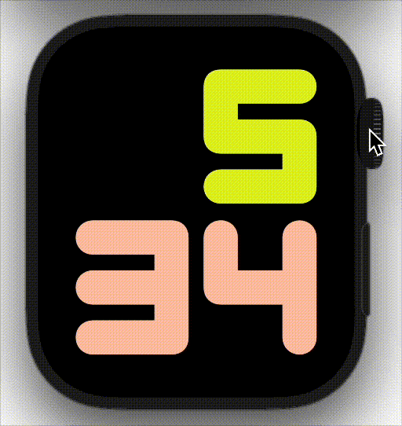
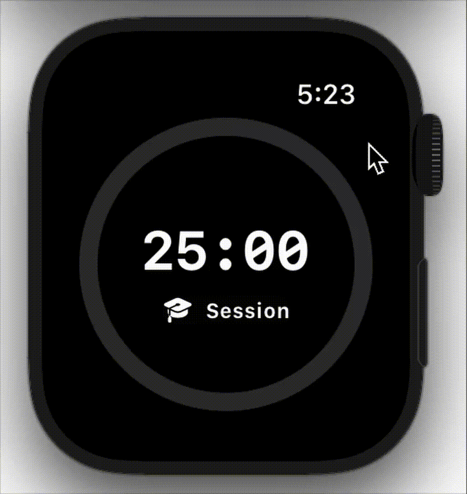
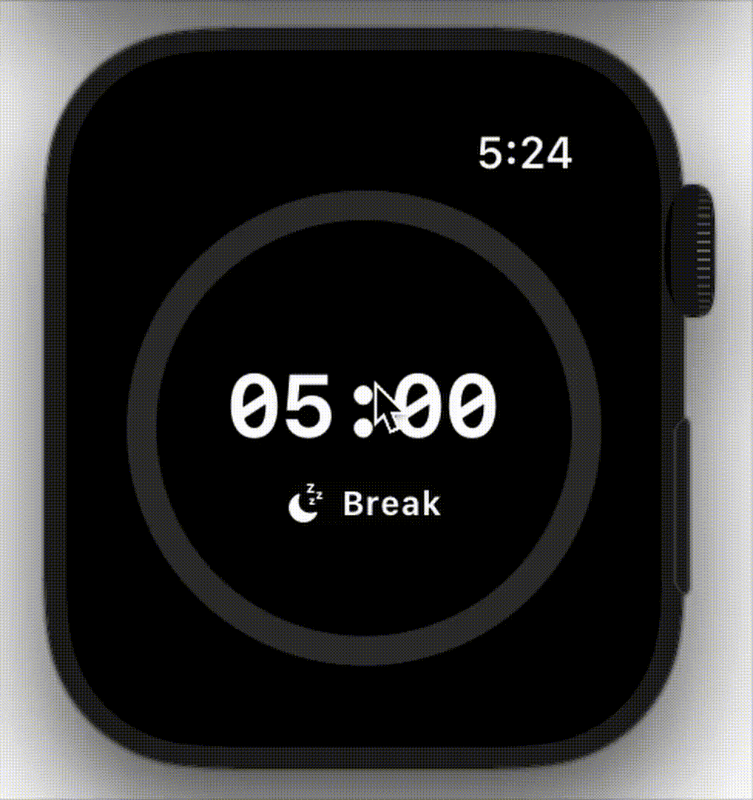

# ⏱️ Doro – A Simple, Reliable Pomodoro Timer for Apple Watch

<p align="center">
  
  
  
</p>

---

## About

**Doro** is a minimalist **Pomodoro timer** made for Apple Watch.  
It looks simple on the surface. Just a dial and some haptics. However, under the hood it handles some neat challenges like:

- **Real-world timing**  
  Instead of incrementing a counter, the timer is tied to actual wall clock time. That means it stays accurate even if you close the app or your watch goes to sleep.

- **Saving and recovering state**  
  If the user quits the app, Doro picks up where you left off by storing timer info in `UserDefaults` and reconciling with the current time when relaunched.

- **Smart haptics**  
  If your watch is locked, the system notification handles the alert. If you’re in the app, Doro runs its own repeating buzz until you dismiss it.

- **Digital Crown interaction**  
  You can adjust session length with the crown, and if you change it while the timer’s running, Doro resets things cleanly.

---

## Features

- ⏲️ **25/5 Pomodoro defaults** (focus & break), but you can tweak the minutes.  
- 🎯 **Clean circular progress dial** with colors chosen on purpose:  
  - **Green** for breaks → psychologically tied to relaxation and recovery.  
  - **Blue** for focus → known to promote calm concentration and productivity.  
- 🔔 **Local notifications** for when you’re not in the app.  
- 💥 **Haptics** that feel native to the wrist.  
- 🌙 **Quick toggle** between focus and break.  
- 🕒 **Automatic switching** between sessions when one finishes.  

---

## Focus and Break Demo

<p align="center">
  
  
</p>

---

## How It’s Built

- **SwiftUI** powers the entire interface with a single source of truth for layout and state.  
- A central `TimerViewModel` (`ObservableObject`) drives all the logic, separating UI from core behavior.  
- **NotificationCenter hooks** handle background/foreground transitions so haptics and notifications never overlap.  
- **Bindings** ensure the Digital Crown adjusts time smoothly and resets timers to avoid unexpected behavior.  
- **Intentional design choices** (colors, haptics, gestures) keep the app simple but give it personality, avoiding the overstimulating UI of other apps.  

None of this is rocket science, but the small details add up: Doro is reliable, feels good to use, and doesn’t get confused if the app quits or the watch locks.

---

## Getting Started

1. Clone the repo:
   ```bash
   git clone https://github.com/kdiaz03/pomodoro-watch.git
2. Open in Xcode
   ```bash
   open Pomodoro.xcodeproj
3. Build and run on a watch simulator and enjoy :)
